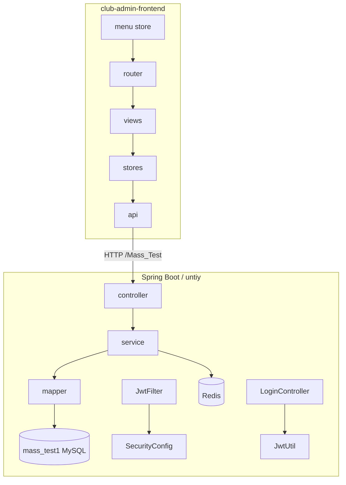

# Mass_Test 项目概览文档

> 本文档基于 `.cursor/skills/项目.md` 分析框架自动生成，用于团队沟通与后续重构参考。  
> 生成时间：2026-06-27

---

## 1. 项目概览

### 1.1 基本信息

| 项 | 内容 |
|---|---|
| **项目名称** | Mass_Test1（社团综合管理平台 / Club Administration System） |
| **Maven 坐标** | `com.unity:Mass_Test1:0.0.1-SNAPSHOT` |
| **项目描述** | springboot学习框架 |
| **仓库类型** | 前后端分离单体仓库（Spring Boot 后端 + Vue 3 管理端） |
| **主启动类** | `untiy.MassTestApplication` |
| **服务地址** | `http://localhost:100/Mass_Test` |
| **API 文档** | Knife4j：`http://localhost:100/Mass_Test/doc.html` |

### 1.2 技术栈

| 层级 | 技术 | 版本 |
|---|---|---|
| 后端框架 | Spring Boot | 2.7.18 |
| ORM | MyBatis-Plus | 3.2.0 |
| 安全 | Spring Security + JWT (jjwt) | 0.11.5 |
| 缓存 | Spring Data Redis | — |
| API 文档 | Knife4j / springdoc-openapi | 4.3.0 |
| 数据库 | MySQL | 8.0.33 |
| 连接池 | Druid | — |
| 前端 | Vue 3 + TypeScript + Vite | — |
| UI | Element Plus | — |
| 状态管理 | Pinia | — |
| 路由 | Vue Router 5（Hash 模式） | — |
| 图表 | ECharts | — |
| 工具 | Lombok、Fastjson | 1.2.83 |
| Java 版本 | JDK | 1.8 |

### 1.3 关键配置（`application.yml`）

| 配置项 | 值 |
|---|---|
| 服务端口 | `100` |
| Context Path | `/Mass_Test` |
| 数据库 URL | `jdbc:mysql://127.0.0.1:3306/mass_test1` |
| 数据库用户 | `root` / `123456` |
| Redis | `127.0.0.1:6379`，password `123456`，database `0` |
| JWT 过期时间 | `360000` ms（6 分钟，可配置） |
| JWT Secret | `jwt.secret`（见配置文件，生产环境需更换） |
| 文件上传限制 | 300MB |
| MyBatis-Plus | `table-underline: true`，`column-underline: true` |
| 日志级别 | `untiy.mapper: debug`，`untiy.filter: debug`，`org.springframework.security: DEBUG` |

### 1.4 根目录结构

```
Mass_Test/
├── pom.xml                         # Maven 构建（后端）
├── mvnw / mvnw.cmd                 # Maven Wrapper
├── PROJECT_OVERVIEW.md             # 本文档
├── img.png
│
├── src/                            # 后端源码
│   ├── main/java/untiy/            # Java 业务代码
│   ├── main/resources/             # 配置、Mapper XML、代码生成模板
│   ├── test/java/untiy/            # 单元测试
│   └── api/spec/api-docs.json      # OpenAPI 规范
│
├── club-admin-frontend/            # Vue 3 管理端
│
├── mysql/                          # 数据库脚本
│   ├── mass_test1.sql              # 全量建表 + 种子数据
│   └── fix_bcrypt_passwords.sql    # BCrypt 密码迁移模板（可选）
│
└── .cursor/skills/                 # Cursor 技能与项目文档
    ├── 项目.md                     # 项目分析指令
    ├── login.md                    # JWT/登录规范
    ├── skill.md                    # 前端开发规范
    └── 接口文档.docx               # 接口 Word 文档
```

---

## 2. 数据库设计

> 数据源：`mysql/mass_test1.sql`（MySQL 8.0.13，Schema：`mass_test1`）

### 2.1 表间关系

```
┌─────────────────────────────────────────────────────────┐
│                    RBAC 权限体系                          │
│  sys_user ←→ sys_user_role ←→ sys_role                  │
│                    ↓                                      │
│              sys_role_menu ←→ sys_menu                   │
│              sys_data_permission                         │
└─────────────────────────────────────────────────────────┘

┌─────────────────────────────────────────────────────────┐
│                    组织架构                              │
│  sys_college → sys_major                                 │
│  sys_club → sys_department                               │
└─────────────────────────────────────────────────────────┘

┌─────────────────────────────────────────────────────────┐
│                    活动模块                              │
│  activity_category → activity_apply → activity_approve_flow │
│                              ↓                           │
│                       activity_sign                      │
└─────────────────────────────────────────────────────────┘

┌─────────────────────────────────────────────────────────┐
│                    通知模块                              │
│  notice_category → notice_info → notice_read_record    │
└─────────────────────────────────────────────────────────┘

┌─────────────────────────────────────────────────────────┐
│                    统计                                  │
│  club_statistics（按 club_id + stat_date）               │
└─────────────────────────────────────────────────────────┘
```

### 2.2 全表清单（18 张）

| 表名 | 说明 | 主要关联 |
|---|---|---|
| `sys_user` | 用户基础表（username=学号/工号） | → sys_user_role |
| `sys_role` | 角色表（role_code、role_level、data_scope） | → sys_user_role、sys_role_menu |
| `sys_user_role` | 用户-角色关联（含 scope_type/scope_id 数据范围） | user_id, role_id |
| `sys_menu` | 菜单（route_path、component_path、permission_code） | → sys_role_menu |
| `sys_role_menu` | 角色-菜单关联 | role_id, menu_id |
| `sys_data_permission` | 数据权限规则 | role_id |
| `sys_college` | 学院 | → sys_major, sys_club |
| `sys_department` | 社团部门 | club_id |
| `sys_major` | 专业 | college_id |
| `sys_club` | 社团 | college_id, advisor_id |
| `activity_category` | 活动分类 | → activity_apply |
| `activity_apply` | 活动申请（审批状态、预算等） | club_id, category_id |
| `activity_approve_flow` | 审批流程步骤 | activity_id |
| `activity_sign` | 活动签到（含 GPS point） | activity_id, user_id |
| `notice_category` | 通知分类 | → notice_info |
| `notice_info` | 通知内容（富文本、接收范围 JSON） | category_id |
| `notice_read_record` | 阅读/确认记录 | notice_id, user_id |
| `club_statistics` | 社团日统计 | club_id |

### 2.3 核心表字段说明

#### `sys_user` — 用户基础表

| 字段 | 类型 | 说明 |
|---|---|---|
| `id` | bigint | 主键 |
| `username` | varchar(50) | 登录账号（学号/工号），唯一 |
| `password` | varchar(255) | 加密密码（BCrypt） |
| `real_name` | varchar(50) | 真实姓名 |
| `gender` | tinyint | 0未知 1男 2女 |
| `user_type` | tinyint | 1学生 2老师 3管理员 |
| `student_no` / `teacher_no` | varchar(50) | 学号/工号冗余 |
| `status` | tinyint | 0禁用 1正常 |
| `create_time` / `update_time` | datetime | 时间戳 |

#### `sys_user_role` — 用户角色关联

| 字段 | 类型 | 说明 |
|---|---|---|
| `user_id` | bigint | 用户 ID |
| `role_id` | bigint | 角色 ID |
| `scope_type` | tinyint | 范围类型：1学院 2社团 3部门 4专业 5班级 |
| `scope_id` | bigint | 具体范围 ID |

#### `activity_apply` — 活动申请

| 字段 | 类型 | 说明 |
|---|---|---|
| `activity_no` | varchar(50) | 活动编号，唯一 |
| `club_id` | bigint | 主办社团 |
| `approve_status` | tinyint | 1草稿 2待审批 3审批中 4已通过 5已驳回 6已取消 |
| `current_approve_step` | int | 当前审批步骤 |
| `budget` | decimal(10,2) | 预算金额 |

#### `notice_info` — 通知信息

| 字段 | 类型 | 说明 |
|---|---|---|
| `receiver_type` | tinyint | 1全体学生 2全体老师 3指定角色 4指定社团 5指定人员 |
| `receiver_values` | json | 接收者值（角色/社团/用户 ID 列表） |
| `need_confirm` | tinyint | 是否需要确认阅读 |
| `status` | tinyint | 0草稿 1已发布 2已撤回 |

### 2.4 种子数据说明

- SQL 种子文件中部分 `password` 为**明文**（如 `123456`），应用使用 `BCryptPasswordEncoder` 校验。
- 导入后建议通过 `POST /register/single` 注册新用户，或执行 `mysql/fix_bcrypt_passwords.sql`（需填入 BCrypt 哈希）。

---

## 3. 代码架构

### 3.1 后端包结构（`src/main/java/untiy`）

```
untiy/
├── MassTestApplication.java        # @SpringBootApplication 入口
│
├── controller/          (21)       # REST 接口层
├── service/             (18)       # 业务接口定义
├── service/impl/        (20)       # 业务实现（含 UserDetailServiceImpl）
├── mapper/              (19)       # MyBatis-Plus 数据访问
│
├── entity/              (19+)      # 实体、DTO、View、VO
│   ├── view/                       # 查询视图对象
│   └── vo/                         # 前端展示对象
├── model/               (18)       # MyBatis-Plus @TableName 模型
│
├── config/              (5)        # Spring / JWT / Redis / CORS / OpenAPI
├── security/            (1)        # SecurityConfig
├── filter/              (2)        # JwtFilter、IgnorePathsProperties
├── advice/              (1)        # GlobalExceptionHandler
├── exception/           (3)        # EIException、ErrorConfig
├── annotion/            (3)        # @IgnoreAuth 等自定义注解
└── utils/               (14)       # R、JwtUtil、MPUtil、分页等工具
```

### 3.2 分层职责

| 包 | 职责 |
|---|---|
| `controller` | 接收 HTTP 请求，参数绑定，调用 Service，返回 `R` |
| `service` / `service.impl` | 业务逻辑、事务、权限组装 |
| `mapper` | 数据库 CRUD，自定义 SQL |
| `entity` | 与数据库表映射的 Java 对象、DTO |
| `model` | MyBatis-Plus 代码生成模型 |
| `filter` | JWT 认证过滤器 |
| `config` | Spring 配置类 |
| `utils` | 公共工具（响应封装、JWT、分页、SQL 过滤等） |

### 3.3 核心类说明

| 类 | 路径 | 职责 |
|---|---|---|
| `R` | `utils/R.java` | 统一响应 `{ code, msg, data }` |
| `GlobalExceptionHandler` | `advice/GlobalExceptionHandler.java` | 全局异常 → `R.error()` |
| `JwtUtil` | `utils/JwtUtil.java` | JWT 签发 / 校验 / 解析 username |
| `JwtFilter` | `filter/JwtFilter.java` | Token 拦截、Redis 权限、SecurityContext |
| `SecurityConfig` | `security/SecurityConfig.java` | 无状态 Security、白名单、过滤器链 |
| `UserDetailServiceImpl` | `service/impl/UserDetailServiceImpl.java` | Spring Security 用户加载 |
| `LoginController` | `controller/LoginController.java` | 登录、Token 签发、Redis 权限缓存 |
| `MPUtil` | `utils/MPUtil.java` | 分页、动态条件、驼峰→下划线列名 |
| `IgnorePathsProperties` | `filter/IgnorePathsProperties.java` | `security.ignore.urls` 白名单 |

### 3.4 Mapper 与 XML 对应

| Mapper | 表 | XML |
|---|---|---|
| `SysUserMapper` | sys_user | SysUserMapper.xml（含 selectByUsername） |
| `SysUserRoleMapper` | sys_user_role | SysUserRoleMapper.xml |
| `SysRoleMapper` | sys_role | SysRoleMapper.xml |
| `SysRoleMenuMapper` | sys_role_menu | SysRoleMenuMapper.xml |
| `SysMenuMapper` | sys_menu | SysMenuMapper.xml |
| `SysDataPermissionMapper` | sys_data_permission | SysDataPermissionMapper.xml |
| `SysCollegeMapper` | sys_college | SysCollegeMapper.xml |
| `SysDepartmentMapper` | sys_department | SysDepartmentMapper.xml |
| `SysMajorMapper` | sys_major | SysMajorMapper.xml |
| `SysClubMapper` | sys_club | SysClubMapper.xml |
| `ActivityCategoryMapper` | activity_category | ActivityCategoryMapper.xml |
| `ActivityApplyMapper` | activity_apply | ActivityApplyMapper.xml |
| `ActivityApproveFlowMapper` | activity_approve_flow | ActivityApproveFlowMapper.xml |
| `ActivitySignMapper` | activity_sign | ActivitySignMapper.xml |
| `NoticeCategoryMapper` | notice_category | NoticeCategoryMapper.xml |
| `NoticeInfoMapper` | notice_info | NoticeInfoMapper.xml |
| `NoticeReadRecordMapper` | notice_read_record | NoticeReadRecordMapper.xml |
| `ClubStatisticsMapper` | club_statistics | ClubStatisticsMapper.xml |
| `CommonMapper` | 通用 | CommonMapper.xml |

### 3.5 前端结构（`club-admin-frontend/src`）

```
src/
├── main.ts                 # 入口：Pinia、Router、Element Plus
├── App.vue
│
├── api/                    # 22 个 API 模块（与后端 Controller 对应）
│   ├── index.ts            # 统一导出
│   ├── crudFactory.ts      # 通用 CRUD 工厂
│   ├── login.ts            # 登录/注册
│   └── (各业务 api/*.ts)
│
├── views/                  # 页面视图
│   ├── login/index.vue     # 登录/注册
│   ├── dashboard/index.vue # 首页仪表盘
│   ├── member/index.vue    # 成员管理
│   ├── club/list.vue       # 社团列表
│   ├── activity/           # 活动申请、审批、签到
│   ├── notice/index.vue    # 通知管理
│   └── statistics/index.vue# 统计图表（ECharts）
│
├── router/
│   ├── index.ts            # 静态路由 + 登录守卫
│   └── dynamic.ts          # 后端菜单驱动的动态路由
│
├── stores/
│   ├── user.ts             # token、username、角色、clubScope
│   └── menu.ts             # 菜单树 → 动态路由
│
├── layouts/MainLayout.vue  # 侧边栏 + 顶栏 + router-view
├── components/SidebarMenu.vue
│
├── utils/
│   ├── request.ts          # Axios（baseURL=/Mass_Test，Token 注入）
│   ├── permission.ts       # 权限指令、预算可见性
│   └── format.ts           # 树形数据格式化
│
└── types/
    ├── api.ts              # R 响应类型
    └── generated.ts        # OpenAPI 生成的实体类型
```

**前端开发服务器：** 端口 `5173`，代理 `/Mass_Test` → `http://localhost:100`

---

## 4. 接口清单

> 完整路径前缀：`/Mass_Test`  
> 统一响应格式：`R { code: 0, msg?, data?, token?, username?, ... }`  
> 认证 Header：`Token: <jwt>`（前端同时设置 `Authorization: Bearer <jwt>`）

### 4.1 认证模块

| 接口路径 | 方法 | 描述 | 权限 | 请求参数 | 响应 |
|---|---|---|---|---|---|
| `/login/allocation` | POST | 用户登录 | 公开 | `name`, `password`（RequestParam） | `{ code:0, token, username }` |
| `/register/single` | POST | 用户注册 | 公开（@IgnoreAuth） | `RegisterDTO`（RequestBody） | `{ code:0, msg:"注册成功" }` |

### 4.2 通用 CRUD 模式

各业务 Controller 均遵循以下接口约定（以 `SysUser` 为例，其他模块将 `SysUser` 替换为对应实体名）：

| 接口路径 | 方法 | 描述 | 权限 | 说明 |
|---|---|---|---|---|
| `/sys-user/listSysUser` | GET | 全量列表 | 需认证 | 无分页 |
| `/sys-user/listSysUser_F` | GET | 前端分页查询 | 公开（@IgnoreAuth） | param + 实体字段，支持 page/limit/sidx/order |
| `/sys-user/listSysUser_B` | GET | 后端分页查询 | 需认证 | 同上 |
| `/sys-user/query` | GET | 条件查询 | 需认证 | 实体字段模糊/精确匹配 |
| `/sys-user/detailSysUser_F/{id}` | GET | 前端详情 | 公开（@IgnoreAuth） | PathVariable id |
| `/sys-user/detailSysUser_B/{id}` | GET | 后端详情 | 需认证 | PathVariable id |
| `/sys-user/add_F` | POST | 前端新增 | 公开（@IgnoreAuth） | RequestBody 实体 |
| `/sys-user/add_B` | POST | 后端新增 | 需认证 | RequestBody 实体 |
| `/sys-user/updateSysUser_F` | PUT | 前端更新 | 公开（@IgnoreAuth） | RequestBody 实体 |
| `/sys-user/updateSysUser_B` | PUT | 后端批量更新 | 需认证 | RequestBody List |
| `/sys-user/deleteSysUser_F/{id}` | DELETE | 前端删除 | 公开（@IgnoreAuth） | PathVariable id |
| `/sys-user/deleteSysUser_B` | DELETE | 后端批量删除 | 需认证 | RequestBody List\<Long\> ids |

### 4.3 Controller 模块与根路径

| Controller | 根路径 | 实体 |
|---|---|---|
| `SysUserController` | `/sys-user` | SysUser |
| `SysUserRoleController` | `/sys-user-role` | SysUserRole |
| `SysRoleController` | `/sys-role` | SysRole |
| `SysRoleMenuController` | `/sys-role-menu` | SysRoleMenu |
| `SysMenuController` | `/sys-menu` | SysMenu |
| `SysDataPermissionController` | `/sys-data-permission` | SysDataPermission |
| `SysCollegeController` | `/sys-college` | SysCollege |
| `SysDepartmentController` | `/sys-department` | SysDepartment |
| `SysMajorController` | `/sys-major` | SysMajor |
| `SysClubController` | `/sys-club` | SysClub |
| `ActivityCategoryController` | `/activity-category` | ActivityCategory |
| `ActivityApplyController` | `/activity-apply` | ActivityApply |
| `ActivityApproveFlowController` | `/activity-approve-flow` | ActivityApproveFlow |
| `ActivitySignController` | `/activity-sign` | ActivitySign |
| `NoticeCategoryController` | `/notice-category` | NoticeCategory |
| `NoticeInfoController` | `/notice-info` | NoticeInfo |
| `NoticeReadRecordController` | `/notice-read-record` | NoticeReadRecord |
| `ClubStatisticsController` | `/club-statistics` | ClubStatistics |

> 注：`@IgnoreAuth` 标注的方法在 JwtFilter 白名单之外仍可访问，但标注了该注解的 `_F` 系列接口通常对前端开放。实际鉴权以 `SecurityConfig` + `JwtFilter` 为准。

---

## 5. 安全链路

### 5.1 JWT 认证流程

```
1. 客户端 POST /login/allocation?name={username}&password={password}
2. LoginController → AuthenticationManager.authenticate()
3. UserDetailServiceImpl.loadUserByUsername(username) 从 DB 加载用户
4. 密码 BCrypt 校验通过后，JwtUtil.generateToken(username) 签发 JWT
   - subject = username（学号/工号，禁止存数据库主键 ID）
5. Redis 写入：Key = user:{username}，Value = Collection<GrantedAuthority>，TTL = 1h
6. 返回 { code:0, token, username }
```

### 5.2 请求授权流程

```
1. 请求进入 JwtFilter
2. 检查 request.getServletPath() 是否匹配 security.ignore.urls 白名单 → 放行
3. 从 Header「Token」提取 JWT
4. JwtUtil.validateToken() 校验签名与有效期 → 失败返回 401
5. JwtUtil.getUsernameFromToken() 解析 username
6. Redis GET user:{username} 读取权限集合
   - 未命中 → loadUserByUsername(username) 回源 DB 并补写缓存
7. 构建 UsernamePasswordAuthenticationToken(username, null, authorities)
8. SecurityContextHolder.setAuthentication() → chain.doFilter() 放行
```

### 5.3 权限与数据范围

| 机制 | 实现 |
|---|---|
| 角色权限 | `sys_user_role` → `sys_role.role_code` → `GrantedAuthority("ROLE_xxx")` |
| 菜单权限 | `sys_role_menu` → `sys_menu`（route_path、component_path） |
| 数据范围 | `sys_user_role.scope_type` + `scope_id`（学院/社团/部门等） |
| 数据权限规则 | `sys_data_permission`（表名、字段、条件类型） |
| 动态查询 | `MPUtil.likeOrEq` / `between` / `sort` + MyBatis-Plus `QueryWrapper` |

### 5.4 白名单路径（`security.ignore.urls`）

```
/v2/api-docs/**, /v3/api-docs/**, /swagger-resources/**, /swagger-ui/**,
/doc.html, /webjars/**, /favicon.ico, /js/**, /css/**, /img/**,
/allocation/**, /login/**, /register/**
```

### 5.5 Redis 缓存规范

| 项 | 规范 |
|---|---|
| Key 格式 | `user:{username}`（如 `user:admin`） |
| Value 类型 | `Collection<GrantedAuthority>` |
| 过期时间 | 1 小时 |
| 禁止 | 混用 `user:details:{id}` 等旧格式 Key |

---

## 6. 关键业务流程

### 6.1 活动申请 → 审批 → 签到

```
activity_category（选择分类）
    → activity_apply（填写活动信息，approve_status 状态流转）
        → activity_approve_flow（多步骤审批：approve_role_id / approve_user_id）
            → activity_sign（参与签到：GPS 定位 / 手动 / 补签）
```

**活动审批状态：** 1草稿 → 2待审批 → 3审批中 → 4已通过 / 5已驳回 / 6已取消

### 6.2 通知发布 → 阅读确认

```
notice_category
    → notice_info（设置 receiver_type + receiver_values 指定接收范围）
        → notice_read_record（记录 read_time、is_confirmed）
```

### 6.3 用户登录 → 动态菜单

```
前端 login → 获取 token
    → sysUserApi.query 加载用户信息
    → sysUserRoleApi.query 加载角色
    → menu store 从 sysMenu 构建路由树
    → dynamic.ts router.addRoute() 注册业务页面
```

---

## 7. 模块依赖总览



---

## 8. 后续重构建议

### 8.1 已识别问题

| 问题 | 说明 | 建议 |
|---|---|---|
| 密码存储 | SQL 种子为明文，与 BCrypt 不兼容 | 种子数据改用 BCrypt 或导入后执行迁移脚本 |
| entity / model 重复 | `entity` 与 `model` 包存在重复表映射 | 统一为一套实体，删除冗余 |
| `@IgnoreAuth` 滥用 | 大量 `_F` 写接口标注公开 | 仅查询接口公开，写操作需认证 |
| 403 vs 401 | 无 Token 时 Spring Security 可能返回 403 | 配置 `AuthenticationEntryPoint` 统一 401 |
| 包名拼写 | `annotion` 应为 `annotation` | 重命名包（影响面较大，低优先级） |
| JWT 过期时间 | 当前 360000ms ≈ 6 分钟 | 生产环境建议调整为 24h 或可配置 |
| Fastjson 版本 | 1.2.83 存在已知安全风险 | 升级或替换为 Jackson |

### 8.2 优化方向

- 引入 Request/Response DTO 分层，Controller 不直接暴露 Entity
- 统一 `@Valid` + JSR-303 参数校验
- 接口版本控制（如 `/api/v1/`）
- Redis 缓存统一管理（Spring Cache 或 CacheManager 封装）
- 分页参数白名单校验（防 SQL 注入 via sidx）
- 前后端 OpenAPI 类型自动生成流水线（已有 `generated.ts` 基础）

---

## 9. 相关文档

| 文档 | 路径 | 说明 |
|---|---|---|
| 项目分析指令 | `.cursor/skills/项目.md` | 生成本文档的 Cursor 指令 |
| JWT 登录规范 | `.cursor/skills/login.md` | JWT/Redis Key 统一规范 |
| 前端开发规范 | `.cursor/skills/skill.md` | Vue3/Element Plus 约定 |
| 接口 Word 文档 | `.cursor/skills/接口文档.docx` | 完整接口说明 |
| OpenAPI JSON | `src/api/spec/api-docs.json` | 机器可读 API 规范 |
| 数据库脚本 | `mysql/mass_test1.sql` | 建表 + 种子数据 |

---

*文档结束*
